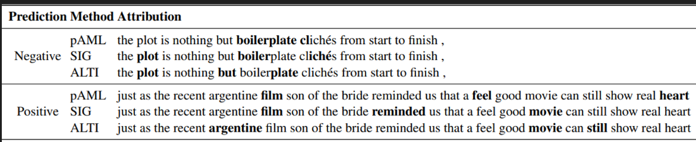

## COPY
# Implementation of Attributive Masking Learning (AML)

<p align="center">
  
</p>

## Introduction
This is the official PyTorch implementation of the Attributive Masking Learning (AML) method.

AML is a self-supervised optimization framework for explaining LMs. By introducing an auxiliary attribution model, AML navigates the complexity of explaining model predictions through a dual-masking approach. Notably, AML’s distinguishing feature lies in its ability to optimize explanations tailored to specific metrics of interest.

## Definitions
pAML - pretrained attribution model

AML - instance-specific finetuned attribution model

## Config
All datasets, models and amounts are in config/tasks.py.

Llama model should be local (huggingface meta llama model requirements).
We used - meta-llama/Llama-2-7b-hf model.

DistilBERT - ag-news - we did not find a finetuned-model. 
We trained one and we will upload it to huggingface.

Datasets sizes are the original datasets sizes, unless defined otherwise.

## Running AML
Examples of running our method on BERT and LLAMA:
```
python run.py emotions BERT BERT SUFFICIENCY
```
```
python run.py emotions LLAMA ROBERTA SUFFICIENCY
```

